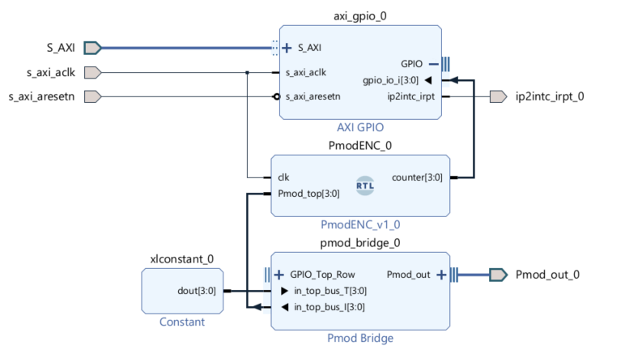

# Vivado Project for PmodENC with Debouncer and AXI GPIO

This repository contains a Vivado project for the PmodENC rotary encoder. The project includes all necessary components, such as a debouncer and AXI GPIO, before it was transformed into an [IP block](https://github.com/TER-Zybo/PetaENC_IP).



## Using the Project as IP Block (Recommended)

If you want to use the project as an IP block, you can refer to the [IP Block - Debouncer and AXI GPIO for the PmodENC](https://github.com/TER-Zybo/PetaENC_IP) repository. This repository contains the IP block version of this project, which can be integrated into other Vivado projects. 

## Getting Started

To use this repository, follow these steps:

### Clone the Repository

First, clone the repository to your local machine:

```sh
git clone https://github.com/TER-Zybo/PetaENC_IP
```

### Open Vivado

Launch the Xilinx Vivado Design Suite on your computer.

### Open the Project

1. **Open Vivado**:
   - Launch Xilinx Vivado Design Suite on your computer.

2. **Open the Project**:
   - In Vivado, select `File > Open Project`.
   - Navigate to the location where you cloned the repository and select the Vivado project file (`.xpr`).
  
3. **Create IP**:
   - In Vivado, select `Tools > Create and Package New IP`
   - Packaging Options : Select option 2 with `PetaENC`
